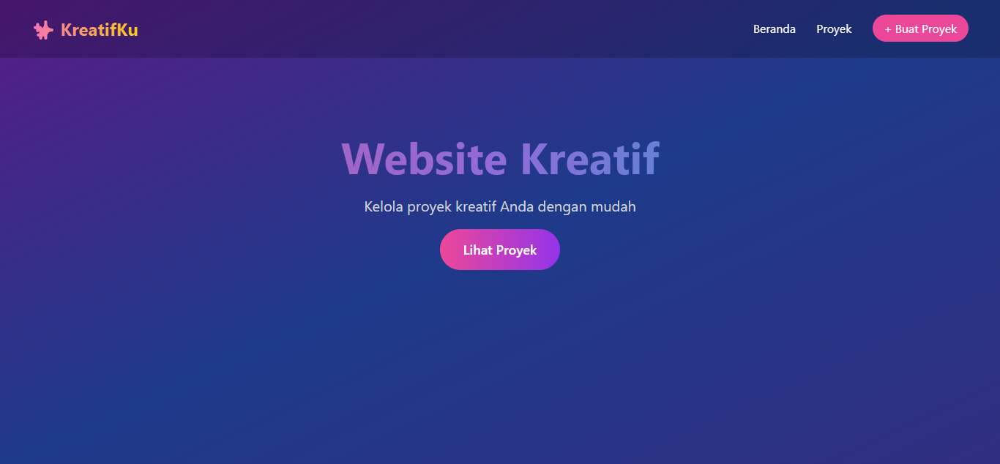
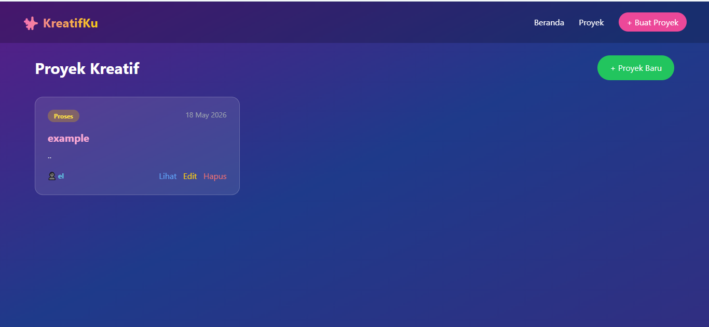
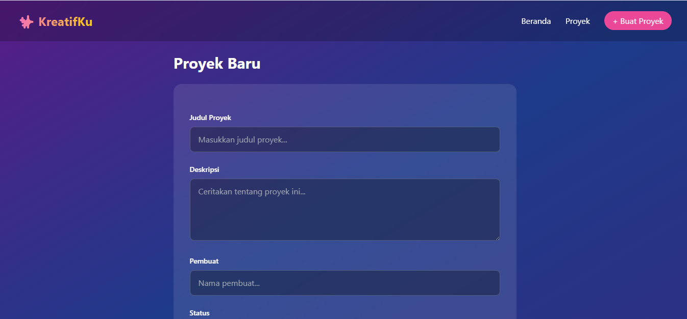
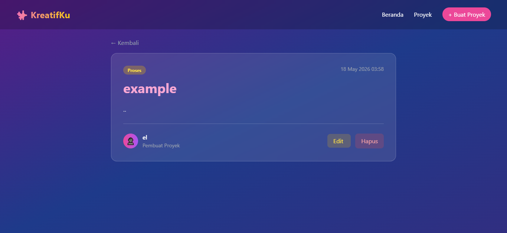
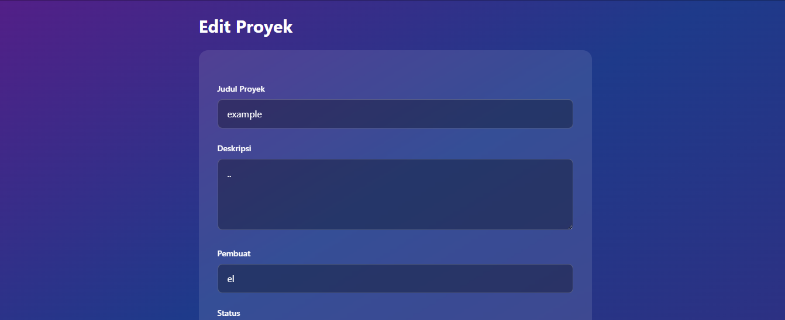

# KreatifKu 

Website manajemen proyek kreatif dengan desain modern gradient, dibangun menggunakan **Laravel 11**, **Tailwind CSS**, dan **MySQL** (XAMPP). Website ini memiliki fitur CRUD lengkap untuk mengelola proyek-proyek kreatif dengan tampilan yang responsif dan interaktif.

Saya membuat website ini untuk mempelajari fundamental Laravel 11 dari nol, mulai dari instalasi, konfigurasi database, migration, model, controller, routing, hingga blade templating.

---

## 🛠️ Dependencies

| Dependency | Fungsi |
|------------|--------|
| **[Laravel 11](https://laravel.com/docs/11.x)** | Framework PHP untuk web development |
| **[Tailwind CSS](https://tailwindcss.com)** | Framework CSS untuk desain modern dan responsif |
| **[Vite](https://vitejs.dev)** | Build tool untuk compile asset (CSS/JS) |
| **[MySQL](https://www.mysql.com)** | Database untuk menyimpan data proyek |
| **[Composer](https://getcomposer.org)** | Dependency manager PHP |
| **[Node.js](https://nodejs.org)** | Runtime JavaScript untuk menjalankan Vite/NPM |

---

---

## Screenshot
<details>
<summary>Dashboard</summary>
Merupakan menu utama dari website ini <br>
  


</details>

<details>
<summary>Project</summary>
Merupakan menu untuk melihat list project



</details>

<details>
<summary>Create Project</summary>
Merupakan menu untuk membuat project



</details>

<details>
<summary>Detail Project</summary>
Merupakan menu untuk melihat detail dari project yang telah dibuat 
  


</details>

<details>
<summary>Edit Project</summary>
Ini merupakan menu untuk mengedit project jika ada yang harus dibenarkan



</details>

---

## 🚀 How to Run

### Prasyarat
Pastikan sudah install:
- [XAMPP](https://www.apachefriends.org) (PHP 8.2+, MySQL, Apache)
- [Composer](https://getcomposer.org)
- [Node.js](https://nodejs.org) (LTS)
- [VS Code](https://code.visualstudio.com)

### Langkah Instalasi

**1. Clone / Copy Project**
```bash
# Jika pakai git
git clone https://github.com/username/kreatifku.git
cd kreatifku

# Atau copy manual folder ke C:\xampp\htdocs\

